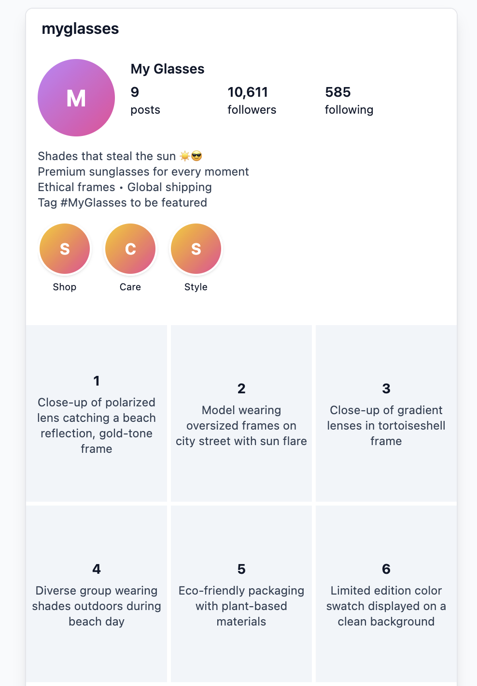
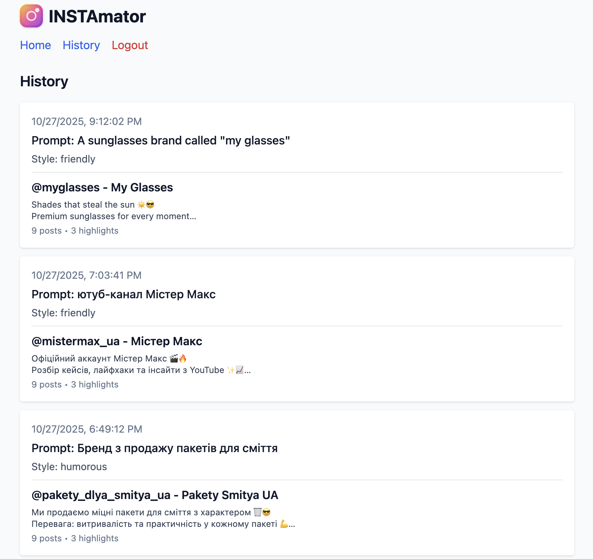

# 📱 INSTAmator — Instagram Marketing Planner

> AI-powered content planning tool that generates complete Instagram marketing strategies with profile, highlights, and 9-post content plans — presented in a realistic Instagram UI.

[](https://www.typescriptlang.org/)
[](https://reactjs.org/)
[](https://nodejs.org/)
[](https://www.mongodb.com/)

[Live Demo](https://instamator-frontend.onrender.com) • [Features](#-features) • [Tech Stack](#-tech-stack) • [Setup](#-quick-start)

---

## ✨ Features

### 🎨 Instagram-Like UI
- **Authentic mockup** — Profile header with avatar, bio (with emoji & line breaks), follower stats
- **Highlights carousel** — Story categories with interactive viewer
- **3×3 Post Grid** — Modern 4:5 aspect ratio posts with detailed modal view
- **Responsive design** — Phone-sized container (max-w-md) for realistic preview

### 🤖 AI-Powered Generation
- **Structured output** — OpenAI Responses API returns strict JSON (profile + highlights + 9 posts)
- **Style variations** — Choose between friendly, professional, or humorous tones
- **Rich content** — Each post includes image description, caption, hashtags, and call-to-action
- **Story highlights** — 2-4 categories with 1-5 stories each

### 💾 Save & Share
- **History persistence** — Save generated plans to MongoDB with full structure
- **Deep linking** — Every saved plan gets a unique shareable URL (`/history/:id`)
- **Public access** — Share links work without authentication
- **Copy to clipboard** — One-click copy for captions and hashtags

### 🔒 Security & Cost Protection
- **Rate limiting** — 5 requests per hour for non-whitelisted IPs (prevents API abuse)
- **IP whitelist** — Admin/trusted IPs bypass rate limits (stored in MongoDB)
- **JWT authentication** — Secure token-based auth for save/history features
- **Password hashing** — bcryptjs with salt rounds for secure storage

### 🎯 UX Polish
- **Skeleton loaders** — Smooth loading states during generation
- **Keyboard navigation** — Esc to close modals, overlay click-to-dismiss
- **Toast notifications** — Clear feedback for all actions
- **Error boundaries** — Graceful error handling

---

## 🛠 Tech Stack

### Frontend
- **React 18** + **TypeScript** — Type-safe component architecture
- **Vite** — Lightning-fast dev server and optimized builds
- **Tailwind CSS** — Utility-first styling with custom animations
- **React Router v6** — Client-side routing with deep links
- **Axios** — HTTP client with interceptors for auth

### Backend
- **Express.js** — RESTful API with JWT authentication
- **MongoDB + Mongoose** — Document storage for user data and history
- **OpenAI API** — Structured generation with strict JSON schemas
- **bcryptjs + JWT** — Secure password hashing and token-based auth

### Architecture Patterns
- **Services layer** — Centralized API logic with typed contracts
- **Component reusability** — `InstagramMock` component used across generate/history/detail
- **Error-first design** — Comprehensive error handling and user feedback
- **Optimistic updates** — Skeleton UIs and loading states for perceived performance

---

## 🎬 Demo


*Generating Instagram content plan with AI*

---


## 📸 Screenshots

> 1. 
> 2. 
> 3. 
> 4. 

---

## 🚀 Quick Start

### Prerequisites
- Node.js 20+ and npm
- MongoDB instance (local or [MongoDB Atlas](https://www.mongodb.com/cloud/atlas))
- OpenAI API key ([get one here](https://platform.openai.com/api-keys))

### 1. Clone & Install

```bash
git clone https://github.com/IluhanCoder/Instamator.git
cd instamator

# Install server dependencies
cd server
npm install

# Install client dependencies
cd ../client
npm install
```

### 2. Configure Environment

Copy the example environment file and configure it:

```bash
cd server
cp .env.example .env
# Edit .env with your actual values
```

Update `server/.env` with your credentials:

```env
PORT=5001
MONGO_URI=mongodb+srv://your-cluster.mongodb.net/marketing-generator
JWT_SECRET=your-secure-random-secret-here
OPENAI_API_KEY=sk-...your-openai-key
OPENAI_MODEL=gpt-4-turbo
```

### 3. Run Development Servers

**Terminal 1 — Backend:**
```bash
cd server
npm run dev
# Server runs on http://localhost:5001
```

**Terminal 2 — Frontend:**
```bash
cd client
npm run dev
# Client runs on http://localhost:5173
```

### 4. Open in Browser

Navigate to `http://localhost:5173` and:
1. Register an account
2. Generate your first content plan
3. Save it to history
4. Share the deep link!

---

## 📁 Project Structure

```
instamator/
├── client/                 # React + TypeScript frontend
│   ├── src/
│   │   ├── components/    # Reusable UI components
│   │   │   ├── InstagramMock.tsx       # Core IG UI component
│   │   │   ├── GeneratorForm.tsx       # Generation form
│   │   │   ├── HistoryList.tsx         # History overview
│   │   │   └── ErrorBoundary.tsx
│   │   ├── pages/         # Route-level pages
│   │   │   ├── Home.tsx
│   │   │   ├── HistoryDetail.tsx       # Deep-link viewer
│   │   │   ├── Login.tsx
│   │   │   └── Register.tsx
│   │   ├── services/      # API client layer
│   │   │   ├── api.ts                  # Axios instance + interceptors
│   │   │   └── aiService.ts            # Typed AI endpoints
│   │   └── App.tsx        # Router + layout
│   ├── package.json
│   └── vite.config.ts
│
├── server/                # Express + MongoDB backend
│   ├── src/
│   │   ├── index.js       # Server entry point
│   │   ├── routes/
│   │   │   ├── aiRoutes.js            # AI generation & history
│   │   │   └── authRoutes.js          # Login/register
│   │   ├── models/
│   │   │   ├── User.js
│   │   │   ├── History.js             # Stores profile + highlights + posts
│   │   │   └── WhitelistedIP.js       # Rate limiting whitelist
│   │   ├── middleware/
│   │   │   ├── auth.js                # JWT verification
│   │   │   └── rateLimiter.js         # API rate limiting
│   │   └── scripts/
│   │       └── migrate-add-userId.js  # DB migration script
│   ├── package.json
│   └── .env
│
└── README.md
```

---

## 🎨 Key Design Decisions

### Why Structured JSON Output?
Instead of free-form text, the app uses OpenAI's strict JSON schema enforcement to guarantee:
- Consistent data shape (profile, highlights, posts array)
- Type-safe client rendering
- No parsing errors or unexpected formats

### Why Deep Links?
Each saved plan gets a unique URL (`/history/:id`) that:
- Works without authentication (public sharing)
- Enables social media sharing, portfolio embedding
- Improves SEO and discoverability
- Professional UX (like Figma, Notion, Miro)

### Why Services Layer?
Centralized API logic in `client/src/services/`:
- Single source of truth for endpoints
- Easy to add request/response interceptors
- Typed contracts prevent runtime errors
- Testable without component coupling

### Why Skeleton Loaders?
Immediate visual feedback during generation:
- Reduces perceived wait time
- Shows users what to expect
- Professional, polished feel

---

## 🔮 Future Enhancements

- [ ] **Export to PDF/PNG** — Download content plans as shareable images
- [ ] **Calendar scheduling** — Plan posts for specific dates
- [ ] **Analytics dashboard** — Track saved plans, popular styles
- [ ] **Image generation** — Integrate DALL-E for actual post visuals
- [ ] **Multi-language support** — i18n for global users
- [ ] **Collaboration** — Share plans with team members

---

## 📝 API Endpoints

### Authentication
- `POST /api/auth/register` — Create account
- `POST /api/auth/login` — Get JWT token

### AI Generation
- `POST /api/ai/generate` — Generate content plan (rate limited: 5 req/hour for non-whitelisted IPs)
  - Body: `{ prompt: string, style: 'friendly' | 'professional' | 'humorous' }`
  - Returns: `{ profile, highlights, posts }`
  - Rate limit: 429 response when exceeded with `retryAfter` in minutes

- `POST /api/ai/save` — Save plan to history (auth required)
- `GET /api/ai/history` — List user's saved plans (auth required)
- `GET /api/ai/history/:id` — Get single plan (public, for deep links)

---

## 🤝 Contributing

This is a portfolio project, but suggestions and feedback are welcome!

1. Fork the repo
2. Create a feature branch (`git checkout -b feature/amazing-feature`)
3. Commit changes (`git commit -m 'Add amazing feature'`)
4. Push to branch (`git push origin feature/amazing-feature`)
5. Open a Pull Request

---

## 📄 License

MIT License — feel free to use this project for learning or portfolio purposes.

---

## 👨‍💻 Author

**Elijah Peichev**  
[LinkedIn](https://www.linkedin.com/in/elijah-peichev-dev) • [GitHub](https://github.com/IluhanCoder)

---

## 🙏 Acknowledgments

- OpenAI for the powerful GPT models
- React & Vite teams for amazing developer experience
- Tailwind CSS for utility-first styling
- MongoDB Atlas for managed database hosting

---